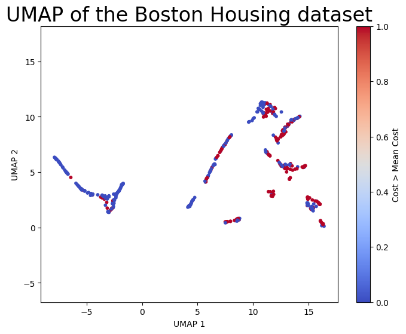
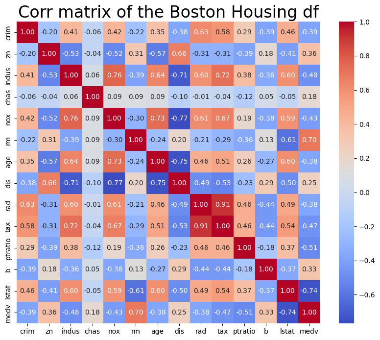
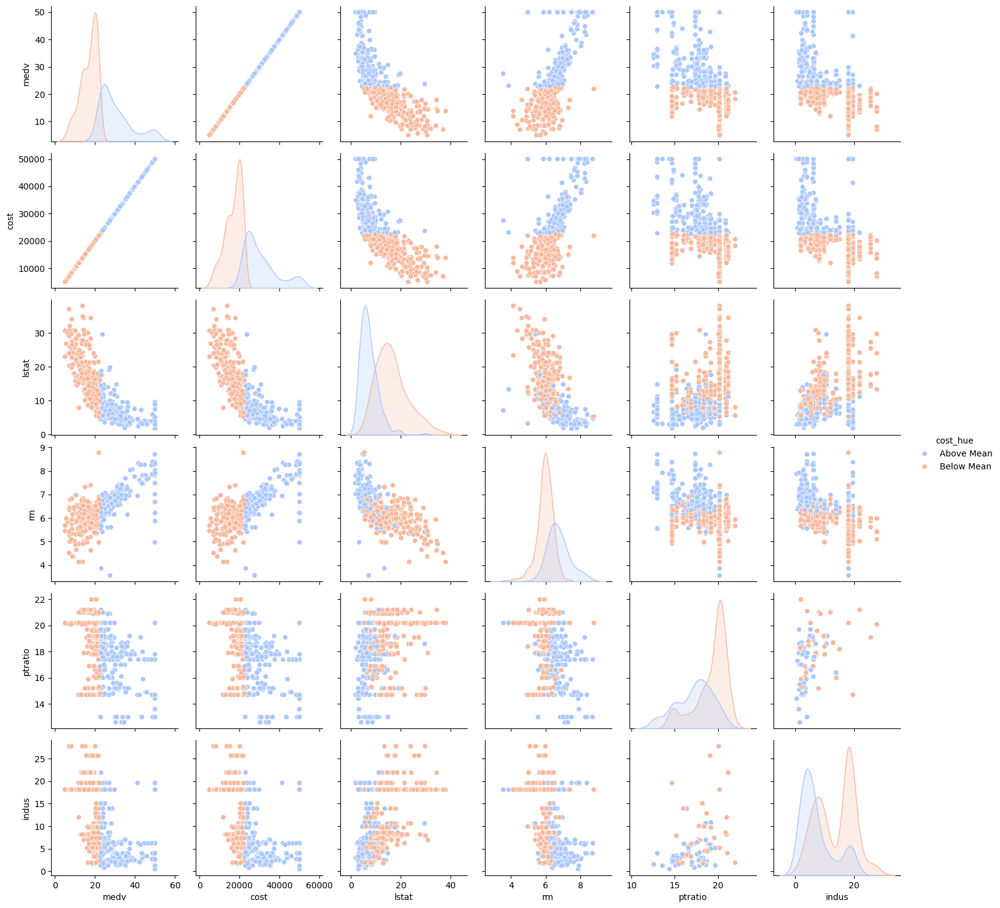
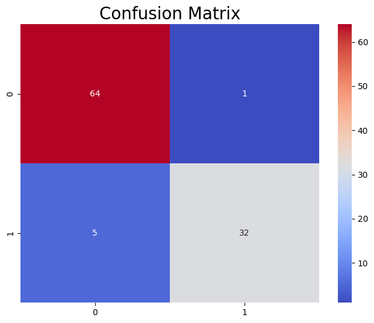
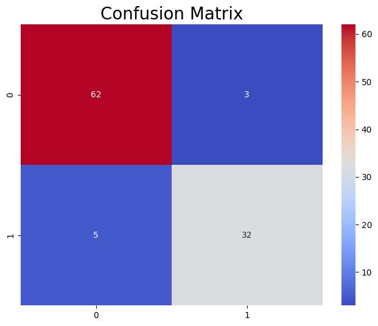

# Assignment 7.1 Report 
## MSAAI 511
## Paker Christenson

Using the boston dataset we were required to make two models for this assignment, one a regression model, and the other was a classification model. Considering the dataset, I used a multitude of methods in able to acheive the best results for both model types. I will be going over the methods used, the results, and the conclusions drawn from the results.
___
## **Data Preprocessing and exploration:**

The Boston dataset is a data set that contains 506 instances and 14 attributes. The dataset is a regression dataset that contains information about the housing prices in Boston. The dataset contains 13 features and 1 target variable. The target variable is the median value of owner-occupied homes in $1000s. The features and descriptions are as follows:

-   `CRIM` - per capita crime rate by town
-   `ZN` - proportion of residential land zoned for lots over 25,000 sq.ft.
-   `INDUS` - proportion of non-retail business acres per town.
-   `CHAS` - Charles River dummy variable (1 if tract bounds river; 0 otherwise)
-   `NOX` - nitric oxides concentration (parts per 10 million)
-   `RM` - average number of rooms per dwelling
-   `AGE` - proportion of owner-occupied units built prior to 1940
-   `DIS` - weighted distances to five Boston employment centres
-   `RAD` - index of accessibility to radial highways
-   `TAX` - full-value property-tax rate per $10,000
-   `PTRATIO` - pupil-teacher ratio by town
-   `B` - 1000(Bk - 0.63)^2 where Bk is the proportion of blacks by town
-   `LSTAT` - % lower status of the population
-   `MEDV` - Median value of owner-occupied homes in $1000's

When pre-processing the data, I looked for very high correlating columns that would offer the most insight to the data and building the deep neural networks linear regression model. Considering that for a regression model there has to be some kinds of distinctions between the data, and their groupings of price, based off of their features. When doing this I used a U-map in order to make sure that the transformed features, could in fact help guide me down the road. However, looking at the U-map for a regression problem, the groups are very clustered together, and make it hard to use regression to predict the `MEDV` for the instance in the data. 

When observing the U-map, we can see a couple of groups, the first is on the left, which is mostly clustered of homes that are below the mean cost. Which means that the characteristics of the instnaces are very similar. However moving over to the left, we can see that the instances are more spread out, and have a higher cost. This means that the characteristics of the instances are more varied, and have a higher cost. 

## **Correlation matrix for the boston data set:**

Looking at the correlation matrix, we can see that there are lots of very high correlating features with that correspond with each other, but for our target variable, we are able to see that the highest correlating feature was the `rm` column, or the rooms. Considering that, I had the potential though of making some more columns based off the rooms feature if I needed to make some more adustments to the model, and feature engineering. 

## **Pairplot for the boston data set:**

Lastly, I used the Seaborn pairplot to see the distribution of the data, and how the features are distributed. A pairplot is a great way to see the distribution of the data, and how the features are distributed within eachother in the data. Wehn looking at the data, with an additional column called cost, we can see that there are lots of ways that we could potentially group the data, and make some more columns to help the model predict the `MDEV` column. But we are not alowed to classify the data based off of cost, but we are using the engineered column to help identify the groups within that data.

## **Regression Model Analysis**

#### **Model 1**

For the regression model, I used a deep neural network in order to predict the `MDEV` column using tensorflow. While using tensorflow, I used the `Sequential` model, and the `Dense` layers in order to build the model. I used the `Adam` optimizer, and the `mean_squared_error` loss function in order to train the model. I used the `mean_squared_error` loss function because it is a regression problem, and we are trying to predict the `MDEV` column, using any other loss function would not be ideal for this problem. When training the model I used a batch size of 30, and ran the model for 30 epochs. I wanted to keep training short and concise, because I did not want to overfit the model, and I wanted to make sure that the model was able to generalize well. On the first and second model I used the same split for the training and testing data, which was 80% training and 20% testing after scaling the data. For the model accuracy the first model had a MSE of 14.49, accuracy of 30.39%. When checking the accuracy of the mdoel, I wanted to see how many predictions were spaced away from the actual value, and how many were close to the actual value. 

**_This is the print out of the first model:_**

    4/4 [==============================] - 0s 0s/step - loss: 14.4959
    Test Loss: 14.49594497680664
    4/4 [==============================] - 0s 930us/step
    Accuracy: 0.30392156862745096
    Number of predictions within 1 unit of the actual value: 31
    Number of predictions within 2 units of the actual value: 54

with our model only having 85 predictions within 2 units of the actual value, and 31 predictions within 1 unit of the actual value. This means that the model is not very accurate, and is not able to predict the `MDEV` column very well.

### **Model 2**

For model two I again used a very similar architecture to the first model, however the only changes that we made were to the number of layers and changes to the nurons. I still used the same optimizers and ran the same training data with the model as I wanted to keep training to the original as close as possible. 

After training was complete on this second model, the model has a test loss of 11.71 and a RSME of 3.42. This means that the model is able to predict the `MDEV` column with a higher accuracy than the first model. We ran the model for 30 epochs, and used a batch size of 30, and the model slightly improved from the first model.

There was a third model ran, however the mode was not able to predict the `MDEV` column very well, and actually got worse from the second model. 

## **Classification Model Analysis**

### **Model 1**

For the classification model, I used a deep neural network in order to predict the `epensive` column using tensorflow. The expenisve column is a column derived originally from the `MDEV` column. The process to get the `expensive` column was to take the mean of the `MDEV` column, mulitply it by 1000 to get the cost column. lastly the `cost` column was used to find the mean cost, and if the actual value of the cost column is above the price of the mean cost, then the `expensive` column is set to 1, if the cost is below the mean cost, then the `expensive` column is set to 0. 

When traiing the model, I wanted to re-instance the data, as the data was also different from the regression model. The null values were replaced with the mean of the column, and the data was scaled using the `StandardScaler` from the `sklearn` library. The data was then split into training and testing data, with 80% of the data being used for training, and 20% of the data being used for testing.

The first model used for the classification model was a deep neural network, with a modified architecture from the regression model. The model used the `Sequential` model, and the `Dense` layers in order to build the model. I used the `Adam` optimizer, and the `binary_crossentropy` loss function in order to train the model. The model had 5 total layers, and the model was ran for 30 epochs, with a batch size of 32. the activation function used was `relu` for the hidden layers, and `sigmoid` for the output layer. The loss function used for the model was the `binary crossentropy` loss function, as we are trying to predict the `expensive` column, and the `binary crossentropy` loss function is ideal for binary classification problems.

When evaluating the model I used the classification report from the `sklearn` library, and the confusion matrix to see how well the model was able to predict the `expensive` column. 

**_Here is the print out of the first models classification report:_**

              precision    recall  f1-score   support

           0       0.93      0.98      0.96        65
           1       0.97      0.86      0.91        37
    accuracy                           0.94       102
    macro avg      0.95     0.92       0.93       102
    weighted avg   0.94     0.94       0.94       102

### **Confusion Matrix for the First Model:**

The model was able to predict the `expensive` column with an accuracy of 94%, and was able to predict the `expensive` column with a precision of 97%, and a recall of 86%. The model was able to predict the `expensive` column very well, and was able to generalize well on the testing data. The `F1` scores for the model were 0.96 for the `0` class, and 0.91 for the `1` class. The `F1` score is my favorite metric to use when evaluating a model, as it is a combination of the precision and recall of the model, which gives a good overall view of the model.

### **Model 2**

For the second model, I used a very similar architecture to the first model, however the only changes that we made were to the number of layers and changes to the nurons. I still used the same optimizers and ran the same training data with the model as I wanted to keep training to the original as close as possible, the same idea as the regression model.

When evaluating the model, the same metrics were used from the `sklearn` library, and the confusion matrix was used to see how well the model was able to predict the `expensive` column. However, during evaluation, the model did not seem to have anymore improvements from the first model, and the model was not able to predict the `expensive` column better than the first model. 

**_Here is the print out of the second models classification report:_**

              precision    recall  f1-score   support

           0       0.93      0.95      0.94        65
           1       0.91      0.86      0.89        37
    accuracy                           0.92       102
    macro avg      0.92      0.91      0.91       102
    weighted avg   0.92      0.92      0.92       102

### **Confusion matrix for the second model:**

The model did have an increase in the false positives, which means that the model likely started to over fit the data, by just a little. The model only predicted one more more false positive for the inexpensive class. But that could just be due to the model being at its limit for predicting the `expensive` column.

## **Conclusion**

I would like to revist the regression model with a different architecture, and not using a neural network, as the data is not very linear, and the data is not very clustered. I would like to use a different model, and see if the model is able to predict the `MDEV` column better than the deep neural network. I think that if the data were to be clustered a little bit more, that linear regression would be a better model to use for this data. Pointing back to the U-map, that data was very clustered, and not neatly grouped together, so an alternative model would be better to use for this data, as the features are more complex than a standard linear regression model.