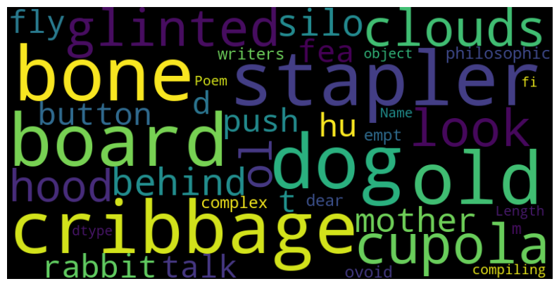

# Parker Christenson Assignment 1 Documentation
Date: 2024-09-05

**Dataset Link:** `https://www.kaggle.com/datasets/tgdivy/poetry-foundation-poems `

### **Introduction to the Dataset**

The dataset that I decided to use for this assignment is a collection of poems from the Poetry Foundation. The dataset contains 13,854 poems and includes the following columns, Title, Poem, Poet, and Tags. The dataset was downloaded from Kaggle, and comes in a CSV file format. The data set is used for Poet classification. I did not have to clean the data, as it was already clean and ready to use, containing no missing values, except in the Tags column, which was not needed for the analysis, and text processing outlined in the instuctions. 

### **Working with the Dataset**

Working with the dataset was fairly easy as mentioned earlier, there was no missing values from the data set, and the data was already clean. The only thing that I had to do was to remove the Tags column, as it was not needed for the analysis. I also had to do some text processing on the Poem column, which included removing punctuation, making all the text lowercase, and tokenizing the text. Consider that the data set was fairly easy to work with I was able to use the library NLTK to do the text processing and tokenization.

During the cleaning process, I used the NLTK 'putkt' function to remove punctuation from the Poem column. I also used the 'lower' function to make all the text lowercase. I then used the 'word_tokenize' function to tokenize the text.

When working with the data set, I did not really run into any sorts of challanges other than having to pip install and do some research on the NLTK library to figure out how to use the functions that I needed to use, but the documentation was helpful and I was able to eventually figure out how to properly use them. 

### **Conclusion and Final Thoughts**

The importance of text pre-processing is critical when working with text data, as it will help the model to better understand the text data when making predictions. The importance of text pre-processing and tokenization when working with text data is important because it helps the model better understand the  underlying context of the text data, and breaks  down more complex wording into smaller more manageable pieces for the LLM to be able to understand. I think that even though there are multiple kinds of tokenization methods, they all end up doing the same thing with minor changes. After tokenizing the data, we then stem the data to remove any suffixes from the words, and then we can use the data to train a model. We are essentially breaking down the text futher and further with every step that we take so our data is smaller. Removing stoppwords is also important because it helps the model to better understand the text data, and helps to remove any words that are not needed for the analysis and prevents the model from being confused by the data. 

In my case doing all of the data preprocesssing steps would help make my model better at predicting the poet, based off of their sequencing and word choice. However, I would like to see and I am curious how if the words were spoken, if the model would be able to predict the poet based off of their voice, or if it would be heavily reliant on the text data, before the data was preprocessed. I think that this would be an interesting experiment to try, and I would like to see how the model would perform in this scenario.